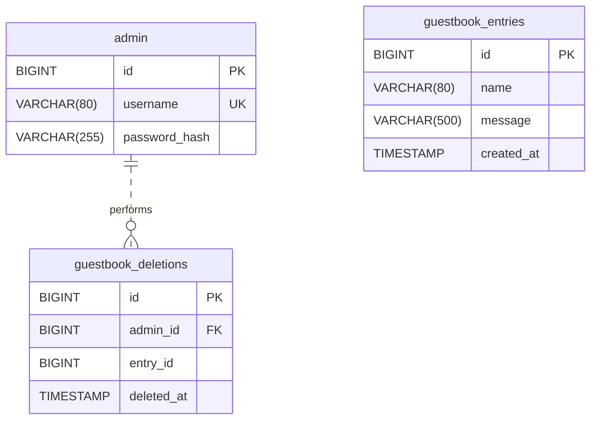

# Database
The `homepage` database stores guestbook messages.

## ERD

```mermaid
erDiagram
    admin ||..o{ guestbook_deletions : performs

    admin {
        BIGINT        id             PK
        VARCHAR(80)   username       UK
        VARCHAR(255)  password_hash
    }

    guestbook_entries {
        BIGINT        id             PK
        VARCHAR(80)   name
        VARCHAR(500)  message
        TIMESTAMP     created_at
    }

    guestbook_deletions {
        BIGINT        id             PK
        BIGINT        admin_id       FK
        BIGINT        entry_id
        TIMESTAMP     deleted_at
    }
```

## Commands
`docker exec -it lolo-homepage-db mariadb -u ${MARIADB_USER} -p${MARIADB_PASSWORD} ${MARIADB_DATABASE}`
